# Next.js 16 / React 19 更新の検証結果

実施：2026-10-04
対象：`next` 14.2.35 → 16.3.8、`react` / `react-dom` 18.3.1 → 19.3.0

目的は「依存の鮮度」で、**サイトの見た目・挙動を変えないこと**を最優先にしています。
更新前後のビルド（`out/`）を同じ手順で実ブラウザに通して比較しました。

## 結果の要約

| 項目 | 結果 |
|---|---|
| `npm audit` | **critical 1 / high 1 → 0 件**（`next` と、その依存の `postcss`） |
| `npm run build` | 成功。16.4秒 → 7.1秒（Turbopack） |
| スクリーンショット 54 枚（4ページ × 4幅のファーストビュー／全体、トップの各セクション位置、ヒーロー各スライド、メニュー、JS無効） | **更新前後で 54 枚中 54 枚がピクセル完全一致（差分 0px）** |
| 挙動テスト（自動送り・ドット・停止・スワイプ・固定バー・アコーディオン・`.reveal`・メニュー・JS無効・GA4） | **更新前後で全項目が一致** |
| GA4 の初回 `page_view` | **ちょうど 1 回**（更新前と同じ）。クライアント遷移でさらに 1 回ずつ |
| コンソールエラー／横スクロール | **なし**（更新前と同じ）。非トップのページには、更新前から Chrome の警告「preload したが使われていない」（ヒーロー画像）が出ており、これも更新前後で同じ |
| 全要素 × 全計算済みプロパティの比較（1,242 要素） | 差は表記ゆれ・丸めの 22 件のみ（下記「変わった点」） |
| microCMS 経路（モックで 3 記事） | 記事HTMLの本文・メタ・`sitemap.xml` が更新前後で同一 |

> **ただし**：次の「変わった点」のとおり、**完全に同一ではない箇所**と、
> **JavaScript の転送量が約 +36KB（gzip）増える**ことは、あらかじめ共有しておきます。

## `npm audit`

```
更新前: 2 vulnerabilities (1 high, 1 critical)
        next    critical  9.3.4-canary.0 – 16.3.0-preview.10（23 件の勧告）
        postcss high      <=8.5.22（4 件の勧告）
更新後: found 0 vulnerabilities     （依存 63 → 57 パッケージ）
```

報告内容（Image Optimizer、Server Components、Server Actions、middleware、rewrites、CSP nonce 等）は、
このサイトでは使っていない機能です。実害は確認していませんでしたが、鮮度のために更新しています。

## コードの変更

| ファイル | 内容 |
|---|---|
| `package.json` / `package-lock.json` | `next ^16.3.8`、`react` / `react-dom ^19.3.0`。CI は `npm ci` で再現できることを確認 |
| `app/news/[id]/page.jsx` | `params` が Promise になったため、`generateMetadata` とページ本体で `await` する |
| `app/robots.js` `sitemap.js` `manifest.js` | 静的エクスポート（`output: "export"`）では `export const dynamic = "force-static"` の明示が必要 |
| `app/globals.css` | `font-variant-numeric: tabular-nums` の 6 ルールに `font-feature-settings: "tnum"` を明示（下記） |

`next.config.mjs`（`output: "export"` / `trailingSlash` / `images.unoptimized` / `basePath`）は**変更なし**で動きます。
`NEXT_PUBLIC_BASE_PATH=/jouyama-run` を付けたビルドでも、出力内の絶対パスがすべて basePath 付きになることを確認しました。
`next/script`（`afterInteractive`）、`viewport` / `metadata`、`useId` は変更不要でした。
`Hero.jsx` の `ref` コールバックは `Set` を返しますが、React 19 は「クリーンアップ関数ではない戻り値」を無視して
解除時に `ref(null)` を呼ぶだけで、`registerImg` 側が `!el` で早期 return するため問題ありません（React の実装を読んで確認）。
開発モード（`next dev`）でも、全ページでコンソールの警告・エラー・ハイドレーション不一致はありません。

### `"tnum"` を明示した理由

旧ビルド（Next.js 14 の PostCSS）は `font-variant-numeric: tabular-nums` を `font-feature-settings: "tnum"` にも展開していました。
要素に直接指定した `font-feature-settings` は継承値と**合成されず置き換わる**ため、body の `"palt"`（和文の字詰め）が
該当要素では外れていました。新ビルドはこの展開をしないので、何もしないと `palt` が効き、
タイムバンドの「スタート」「ナイトスタート」などの和文ラベルの幅が 2〜12px 変わります。
見た目を変えないため `"tnum"` を明示しています（数字の等幅は `font-variant-numeric` 側でも保たれます）。
字詰めを新しい挙動に任せたい場合は、このコミットを revert してください。

## 変わった点（見た目に影響しないもの）

全要素 × 全計算済みプロパティの比較で残った差と、出力の差です。

- **ヘッダー背景が 1/255 だけ違う**：旧ビルドの CSS 圧縮が `rgba(248,247,243,.97)` を `hsla(48,26%,96%,.97)` に丸めており、
  描画は `rgb(247,246,242)` でした。新ビルドはソースどおりの `#f8f7f3f7`（= 248,247,243）です。目視では判別できず、
  ピクセル比較でも差になりません。あえて旧値には戻していません。
- グラデーションの先頭ストップの表記が `0px` → `0%`、背景画像のない要素の `background-position` が `0% 0%` → `0px 0px`（同値）。
- `<body>` の先頭に、空で非表示の `<div hidden><!--$--><!--/$--></div>` が 1 つ増えます（Next.js 16 のメタデータ用の置き場）。
- `<head>` に `<link rel="preload" as="style">`（Google Fonts の 2 本）が増え、画像 preload が React 19 により 1 本追加されます。
  **画像は二重取得になりません**（`hero-1` は更新前後とも 1 リクエスト、同サイズ）。
- `<link rel="manifest">` の `crossorigin="use-credentials"` が付かなくなります（同一オリジンなので動作は同じ）。
- `main` の既定 404 ページ（英語の Next.js 標準ページ）の `<title>` が、`404: This page could not be found.` からサイト名に変わります
  （`<title>` の出力順の変更）。表示は同一です。
- `out/` に、クライアント遷移用の `__next.*.txt` と `_not-found/index.html` が増えます。`sitemap.xml` / `robots.txt` / `manifest.webmanifest` は同一です。

## 変わった点（注意が必要なもの）

- **JavaScript が増えます**：トップのファーストロード JS は **143.2KB → 179.7KB（gzip, +36.5KB）**（無圧縮 456KB → 580KB）。
  React 19 と Next.js 16 のランタイムの増加分です。CSS は 5.9KB → 5.8KB（gzip）で横ばい。
- **リクエストが少し増えます**：画面内の `<Link>` のプリフェッチ（`__next.*.txt`、小さなテキスト）が増え、
  トップのリクエスト数は 390px で 14 → 16、1440px で 12 → 15 になります（JS チャンクが 1 本減る分を差し引いた値）。
- **`next dev` が `AGENTS.md` と `CLAUDE.md` をリポジトリ直下に自動生成します**（Next.js 16.3 の仕様。AI エージェント向け）。
  今回は PR に含めず削除しました。生成させたくない場合は `next.config.mjs` に `agentRules: false` を足せます（未設定のままにしています）。
- Node.js は **20.9 以上**が必要です（CI は `node-version: 20` なので問題ありません）。

## 検証方法

- ブラウザ：Playwright + Chromium 141（ヘッドレス）。`out/` をローカルの静的サーバ（GitHub Pages 相当：ディレクトリは `index.html`、無いパスは `404.html` を 404 で返す）から配信
- 幅：390（タッチ）/ 768 / 1440 / 1920。ページ：`/` `/news/` `/news/n20260601/` `/404.html`
- Google Fonts：`curl`（TLS 検証あり）で取得して `route` で差し込み。更新前後で同じバイト列
- GA4：サンドボックスから `googletagmanager.com` に届かないため、`gtag/js` は空スクリプトで置換し、`window.dataLayer` の中身（`config` と `page_view`）を確認
- `scroll-behavior: smooth` と `position: fixed` のヘッダーのせいで、スクロール直後に撮ると位置がずれるため、即時スクロール＋位置の安定待ちで撮影
- 比較：pixelmatch（threshold 0.1）／全要素の位置・寸法・計算済みスタイル（全プロパティ）／axe-core／`<head>`・JSON-LD・ファイル一覧
- microCMS：`microcms-js-sdk` が使うグローバル `fetch` をモックし、3 記事（カテゴリが単一・配列・なし、HTML エンティティを含む）で Next 14 / 16 をビルドして比較
- **未検証**：Safari / Firefox、実機のタッチ、実際の `gtag.js`（GA 側の集計）、実際の microCMS への接続

## axe-core

`main` の更新前から、トップに `region`（ヒーローが `<main>` の外）の違反が 1 件、404 に 3 件あり、**更新前後で同じ**です
（違反の id と件数は不変。報告される CSS セレクタ文字列だけ、増えた `<div hidden>` の分だけずれます）。
未マージの [PR #6](https://github.com/yuuri1229/jouyama-run/pull/6) に載っている構成では、更新前後とも **全ページ・全幅で 0 件**です。

## PR #6（未マージ）との関係

依頼文にある「受付状況ピル・一時停止ボタン・スワイプ・スマホの固定エントリーバー・ルールのアコーディオン・カスタム 404・JSON-LD がトップだけ」は
`main` には無く、[PR #6](https://github.com/yuuri1229/jouyama-run/pull/6) にだけあります。
そのため、この更新は `main` に対して作り、**#6 の上に同じコミットを載せた使い捨ての作業ツリーでも同じ検証**をしました
（コミットは衝突なしで載ります。ただし `app/globals.css` の `body` ルールは #6 も変更しているため、
どちらかを先にマージすると、もう一方でその数行だけ衝突します）。#6 の構成での結果：

- 57 枚中 57 枚がピクセル完全一致。axe 0 件。GA4 の初回 `page_view` 1 回
- 停止ボタン（押すと止まり、再開で動く）、スワイプ（左で次・右で前・小さな動きと縦スクロールは無反応）、
  固定エントリーバー（各セクション位置での表示／非表示の状態、位置、リンク先。PC では非表示）、
  アコーディオン（クリック・Enter・Space で開閉）、JSON-LD（`SportsEvent` はトップだけ）が更新前後で同一
- **#6 を先にマージする場合の注意**：#6 には `.hero-status-count`（「開催まで49日」）という `tabular-nums` のルールが追加で入っています。
  `"tnum"` の明示が無いと、そこだけ和文が 2px ほど詰まります。#6 の構成を測るときは、同じ 1 行を足して一致を確認しました

## スクリーンショット（更新前｜更新後）

`main` に対して作った更新の比較です。すべて差分 0px でした。

### トップ

| 幅 | 比較 |
|---|---|
| 390 | 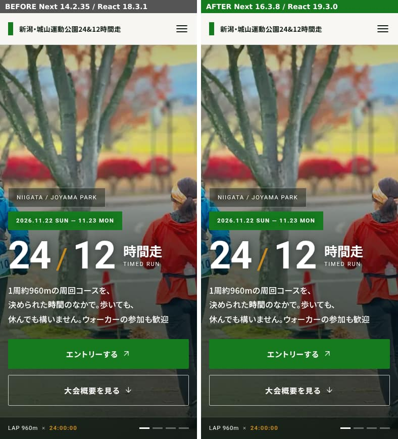 |
| 768 | 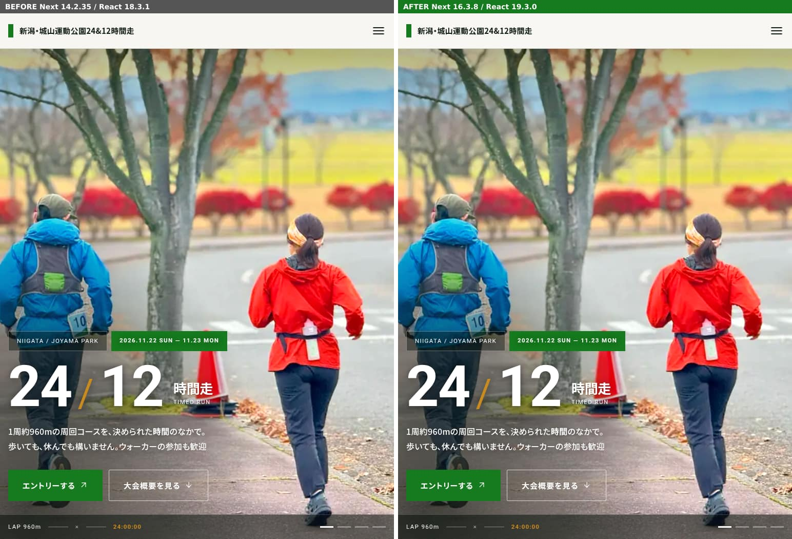 |
| 1440 | 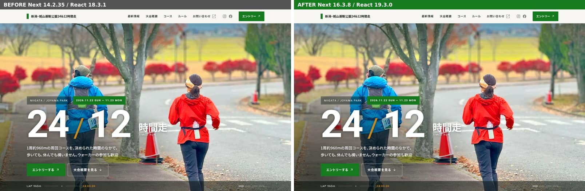 |
| 1920 | 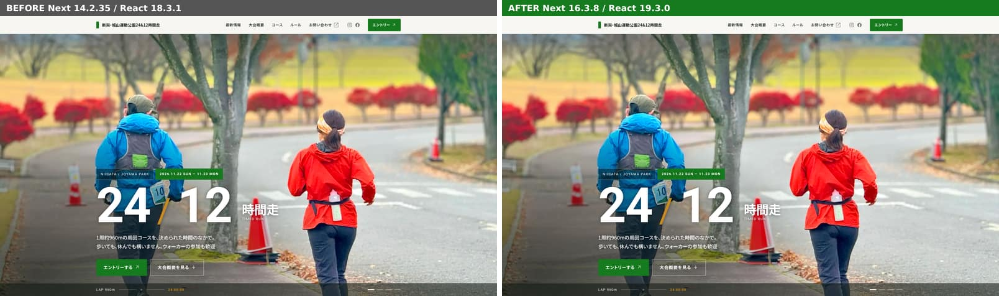 |

全体（スクロールして `.reveal` を出した後）：
[390px](img/main-top-390-full.jpg) / [1440px](img/main-top-1440-full.jpg)

### `/news/`

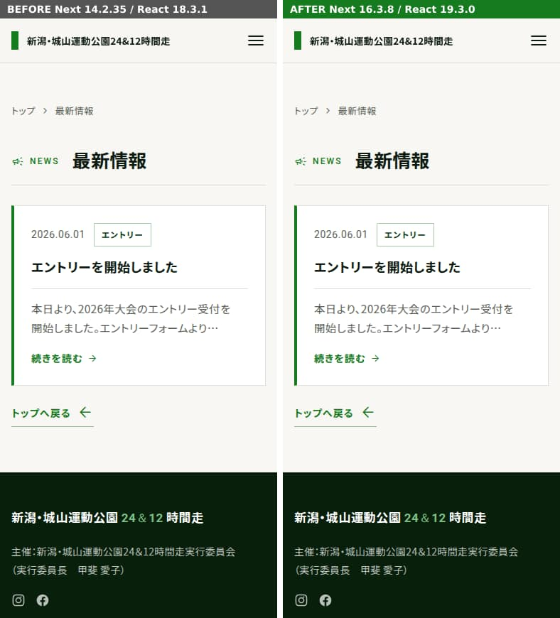
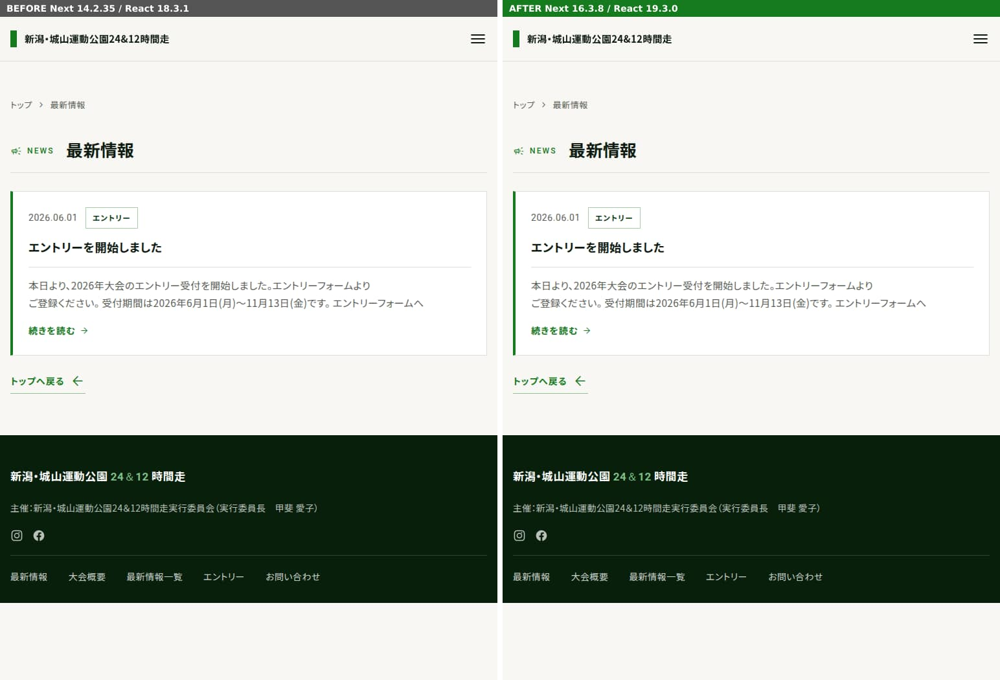
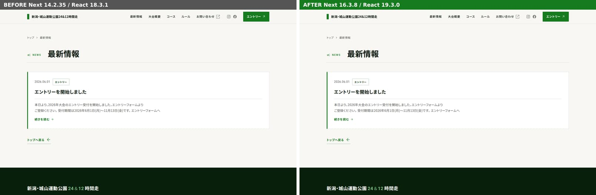
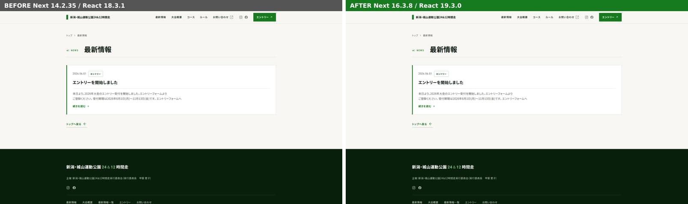

### `/news/n20260601/`

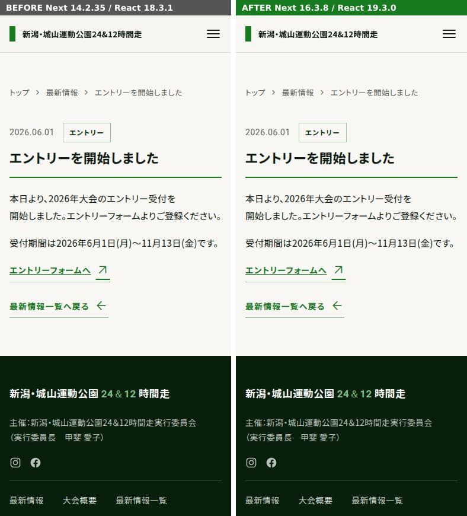
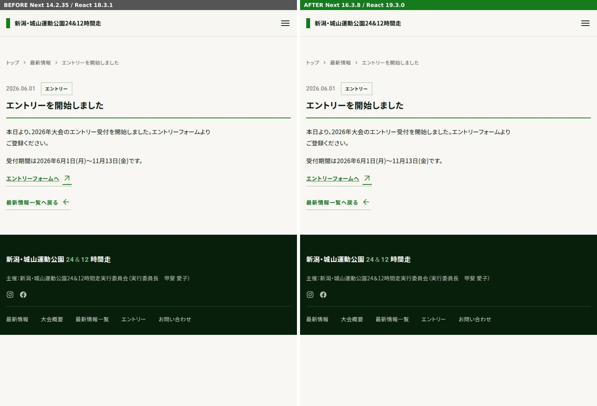
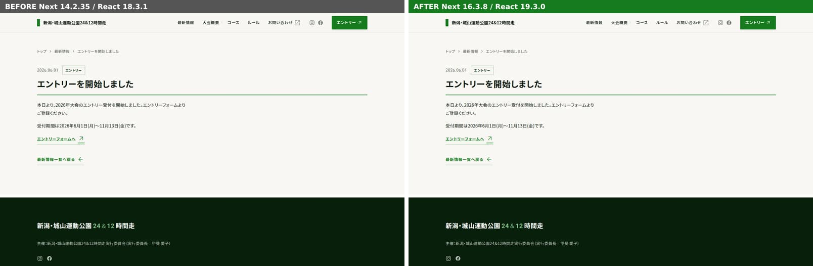
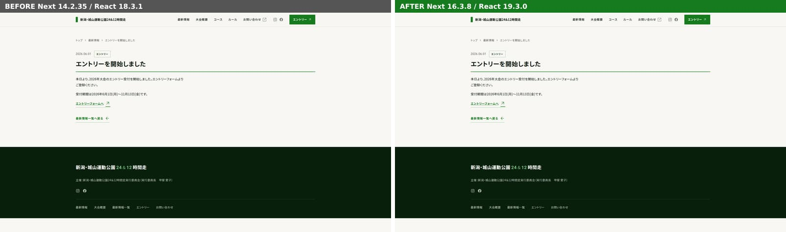

### `/404.html`

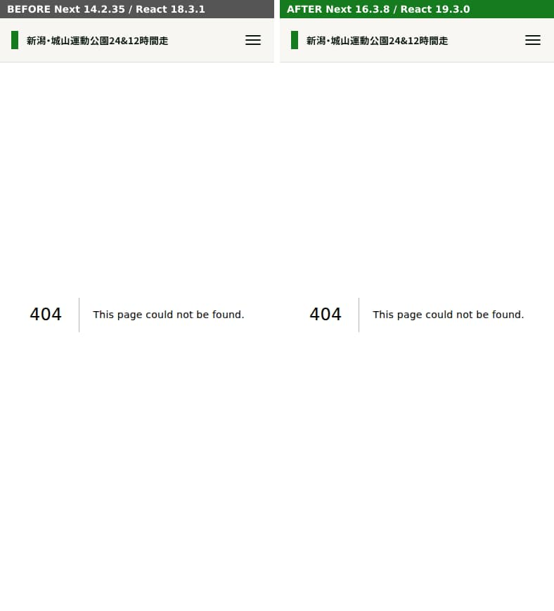
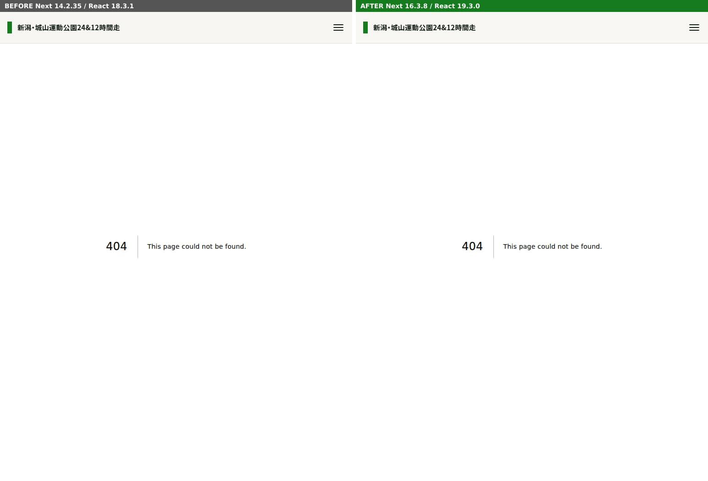
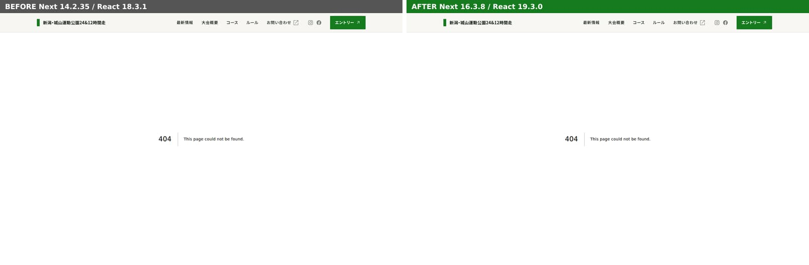
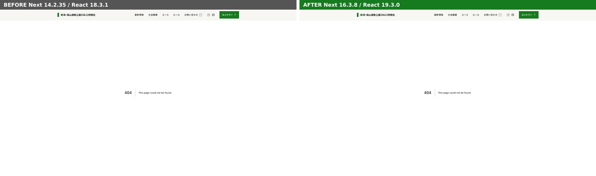

### 参考：PR #6 の構成（受付状況ピル・停止ボタン入り）

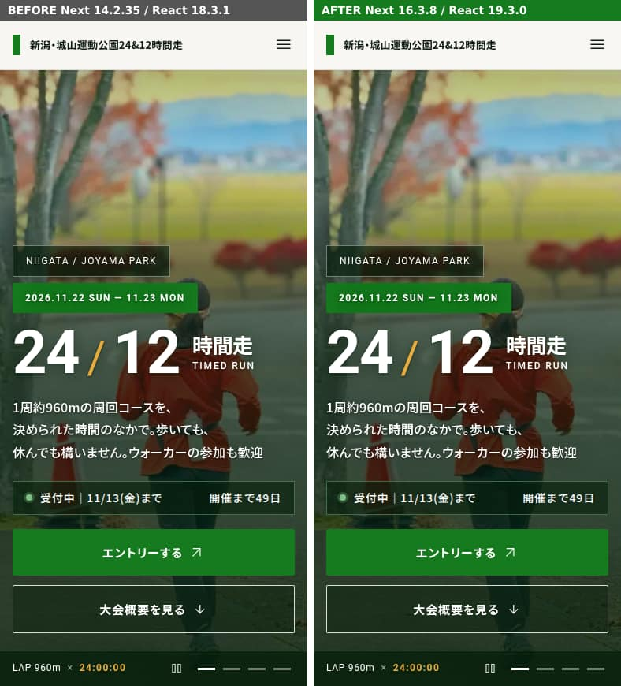
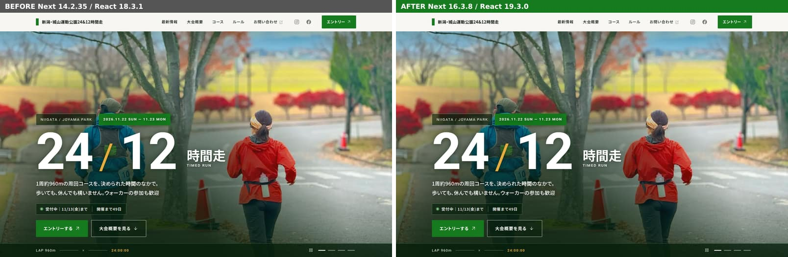
